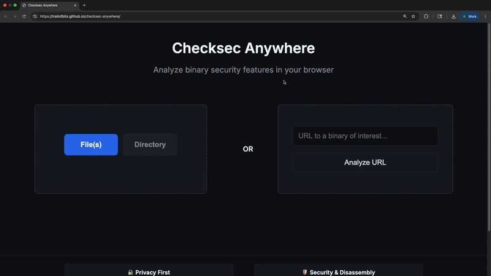

# 🛡️ Checksec Anywhere: Building Checksec Without Boundaries

Analyze binary security features instantly in your browser. No downloads, no uploads, no accounts.

**[Try it now](https://checksec-anywhere.com/)**

> **Your files never leave your browser** - Critical for proprietary software, security-sensitive applications, and compliance-restricted code

## Get Started in 30 seconds

1. Open [https://checksec-anywhere.com/](https://checksec-anywhere.com/) in your browser
2. Drag and drop your binary file
3. Get comprehensive security analysis instantly



## Features

 - ✅ **Multiple Formats** - ELF, PE, and Mach-O from a single interface 
- ✅ **No installation required** - Runs locally in your browser using WASM 
- ✅ **Comprehensive Reports** - All of the properties you're used to seeing and more 
- ✅ **Batch processing** - Drag and drop entire directories  
- ✅ **Shareable results** - Generate static URLs for any report 
- ✅ **Tabbed interface** - Manage multiple analyses simultaneously with an intuitive UI 
- ✅ **SARIF export** - Download reports in industry-standard format

## Performance

Analysis performance for 699 files in `/usr/bin`:
  | Tool | Processing Time |
|----------|----------|
| checksec (bash) | 14.355s |
| checksec (go) | 0.804s |
| Checksec Anywhere (browser) | 2.777s |

## Architecture

### Project Structure
```
checksec-anywhere/
├── checksec.rs/              # Core library + CLI tool (fork of checksec.rs)
├── checksec-wasm/            # WebAssembly bindings for browser
├── frontend/                 # Web application
```

### Core Library (`checksec.rs/`)
The core of Checksec Anywhere is built on [checksec.rs](https://crates.io/crates/checksec), enhanced with:

- **Unified API**: Library and CLI tool in one crate
- **Enhanced Checks**: Additional security analysis features:
  - Fine-grained disassembly for GS detection in PE binaries
  - Checks for mixing of data and code in ELF program headers
  - Address Sanitizer detection
  - And more!
- **SARIF Export**: Industry-standard security report format
- **Compression**: Utilities for shareable result URLs

### WebAssembly Bindings (`checksec-wasm/`)
Exposes core functionality to JavaScript with:

- **`checksec_web(buffer, filename)`** - Main binary analysis function
- **`checksec_compress(results)`** - Compress results for URL sharing  
- **`checksec_decompress(data)`** - Decompress shared results
- **`generate_sarif_report(results)`** - Generate SARIF format reports

### Frontend (`frontend/`)
Modern web application providing:

- **Privacy-first**: All processing happens client-side in WebAssembly
- **Drag & Drop**: Intuitive file upload with directory support
- **Real-time Analysis**: Instant feedback as files are processed
- **Shareable URLs**: Compressed results encoded in static URLs
- **Responsive Design**: Works on desktop and mobile browsers

## Development

### Prerequisites
- Rust toolchain with `wasm32-unknown-unknown` target
- `wasm-pack` for WebAssembly compilation

### Build Commands
```bash
# Build CLI tool
make cli

# Build WebAssembly bindings  
make wasm

# Build both CLI and WASM
make all

# Start local development server (builds WASM first)
make local_instance

# Run tests
make test

# Clean all build artifacts
make clean
```

### Local Development
```bash
# Start development server at http://localhost:8000
make local_instance
```

